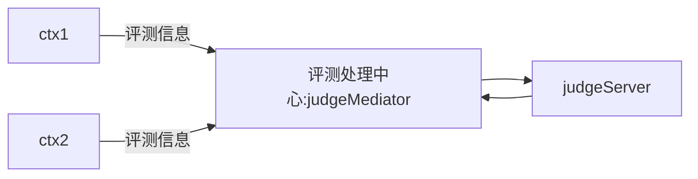
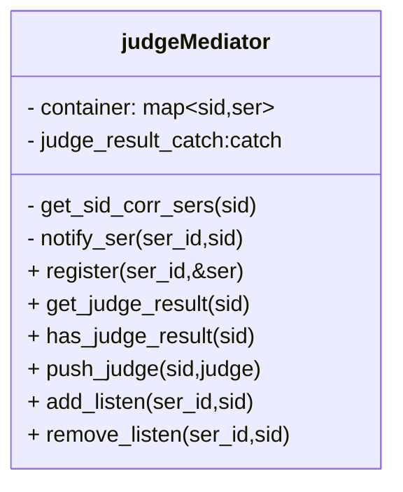

## 1. server 与 judgeServer 进行通信

## 2. judgeMediator 设计

`Mediator`:中介

api设计

`judgeMdiator`与`ser`之间通过pipe socket 进行通知的通信

每个`ser`维护一对pipe socket,和一个noitify_judge_msg函数,judgeMediator能过调用对应ser的`notify_judge_msg`函数来通知有对应的sid消息

`get_sid_corr_sers(sid)`,得到 需要sid评测信息的那些ser_id的集合,集合中ser_id不重复

`register(ser_id,&ser)`,ser注册,后续所有用到ser_id的函数,都要先注册对应的ser_id与ser的关系

`judge_result_cache`一个基于时间的缓存,具有读写锁

`push_judge(sid,judge)`,加入judge信息,等待评测

`notify_ser(ser,sid)` 通知某个ser,有sid的评测信息

`std::optional<msg> get_judge_result(sid)`,得到评测的信息

`has_judge_result(sid)` 是否有评测信息

你`push_judge`后,catch创建一个`key:sid, status:judging`的值,直到超时,或得到完整的评测结果

## ser 设计

ser是`tinyAsync`中的`ioContext`

ser中有关评测的相关设计

为了能够评测代码,ser需要和judgeMediator进行通信.

ser发送测试信息,只需要下面的2步

1. 先对ser进行注册`register(ser_id,&ser)
2. 发送评测数据`judgeMediator.get().push(judge)

用户可能有2种获取评测结果信息的方式:

1. 通过http协议轮询评测结果.缺点:效率低,优点:实现简单
2. 通过websocket协议,被动等待服务端发送评测结果.缺点:实现复杂,优点:效率高,可以知道评测的进程.

client 发送带有请求结果的sid的websocket连接
ser has_judge_result()
yes: 表明正在评测或 cache里有评测的信息
add_listen
等待通知
发生通知,
get_judge_result(sid),一个结果拷贝,share_ptr
发送给client
直到拿到所有的信息,或,超时

no: 查询数据库,一次发送完所有的结果信息

过程如上.

得到通知后,如何唤醒对应sid的协程

一个list存所有的sid

list: -> sid_1 -->sid_2 --> sid_1 --> sid_3

通过遍历list_得到包含所有的sid_1链表

然后调用 SID_Event(list_sid_1) 来resume所有sid_1信息的协程

所以我们设定了一个SID_Event 和SID_EventAwaiter 来实现

1. 协程的listNode链表
2. 挂起协程

如何一个协程超时,应该从SID_Event 删除自己的ListNode