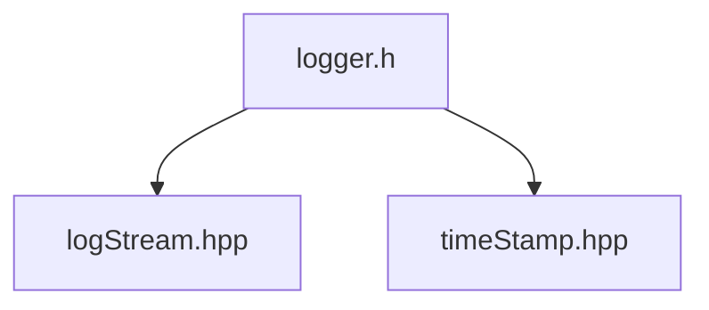

nextBuffer_可以减少前端临界区分配内存的概率，缩短前端临界区长度

这段文字是关于muduo网络库中的多线程异步日志的实现。nextBuffer_是一个指向日志缓冲区的智能指针，它用于在前端线程（即写日志的线程）和后端线程（即负责将日志写入文件的线程）之间传递数据。nextBuffer_可以减少前端临界区分配内存的概率，缩短前端临界区长度，从而提高日志性能和并发度。前端临界区是指前端线程需要加锁保护的代码段，其中包括将当前缓冲区添加到待写入队列中，以及从预备缓冲区中获取新的缓冲区。如果预备缓冲区为空，则需要分配新的内存空间，这会增加临界区的时间和开销。因此，使用nextBuffer_可以避免这种情况，提高效率1

为什么nexBuffer_可以减少前端临界区分配内存的概率?

nexBuffer_可以减少前端临界区分配内存的概率，是因为它在前端线程中预先准备好了一个空闲的缓冲区，当当前缓冲区满了或者到达刷新时间时，可以直接交换给后端线程，而不需要从预备缓冲区中获取新的缓冲区。这样就避免了预备缓冲区为空时，需要动态分配内存的情况。动态分配内存是一个耗时的操作，会增加前端临界区的长度和开销。

但是nextBuffer_ 还是在后端中动态申请的内存,这样并没有减少耗时

nextBuffer_是在后端线程中动态申请的内存，但是这样并不影响前端线程的性能，因为后端线程和前端线程是异步的。后端线程可以在空闲时分配内存，而不会阻塞前端线程。而且，nextBuffer_只有在预备缓冲区为空时才会被使用，这种情况很少发生，所以动态分配内存的次数也很少。

前端是很忙碌的多个线程,而后端通常不会很忙碌,后端3s轮询一次,后端在空闲的时候申请nextBuffer_内存,这样节省了前端的时间.

?? 后端没有申请buffer

## timeStamp 时间戳模块

功能:

- 主要: toFormattedString 得到格式化后的时间字符串

根据: https://www.jianshu.com/p/c9b775d831fb 的说明,`std::chrono::system_clock::now().time_since_epoch().count();`完全可以替代`gettimeofday`,性能上不会有太大的损失

## 模块说明

模块之间的关系

- `logStream` 将各种类型的数据(intergral,double,char ,string等),传入自带的buffer内
- `logger` ,前端,作用:
  1. 格式化相关的信息,如log信息为:`[loglevel] [thread_id] [function_name]: mesg - [filename] [time]`
  2. 日志信息具有多种级别,根据全局的信息级别,对输出的信息进行过滤
  3. 可以设置信息输出接口,灵活配置信息输出的目的地,方便和后端结合
