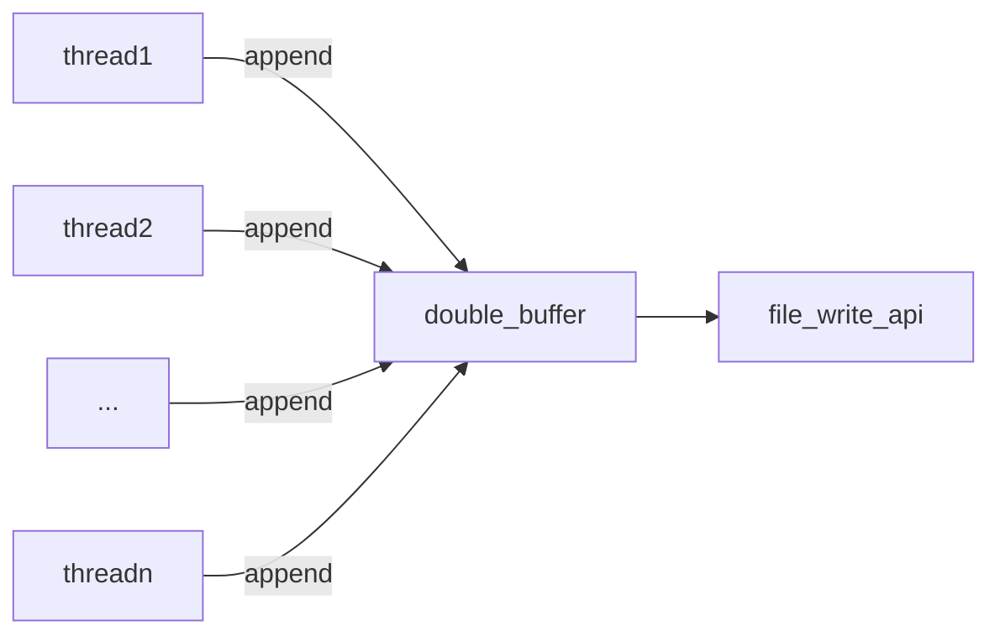
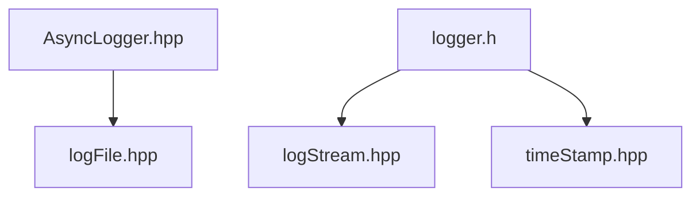

## 说明

`log`模块来自 [Linux多线程服务端编程 使用muduo C++网络库(陈硕)](https://github.com/mobinsheng/books/blob/master/Linux%E5%A4%9A%E7%BA%BF%E7%A8%8B%E6%9C%8D%E5%8A%A1%E7%AB%AF%E7%BC%96%E7%A8%8B%EF%BC%9A%E4%BD%BF%E7%94%A8muduo%20C%2B%2B%E7%BD%91%E7%BB%9C%E5%BA%93.pdf)
第5章:高效的多线程序日志(书P109-P120),[原始的源码](https://github.com/chenshuo/muduo) boost库和C++98语法完成.为了摒弃了boost库的依赖,参考了这个
[Tiny C++ Network Library,C++ 11 重构陈硕的 muduo 库](https://github.com/Shangyizhou/A-Tiny-Network-Library)的相关代码

## 设计思路

具体的细节请参考书上的内容,这里我只叙述一下我认为重要的东西.你也可以看这个[文档](https://github.com/Shangyizhou/A-Tiny-Network-Library/blob/main/%E9%A1%B9%E7%9B%AE%E8%AE%B2%E8%A7%A3/%E5%BC%82%E6%AD%A5%E6%97%A5%E5%BF%97%E6%A8%A1%E5%9D%97.md)

前端后端设计模型

多个前端线程通过双缓冲(AsyncLogger)暴露的接口`append`,向`double_buffer`(双缓冲)区内写入数据.
但达到条件时,3s的轮询,双缓冲互相交换,后端写入数据到对应的文件内.以此来实现异步日志.

## 模块说明

模块之间的关系,整个模块分为前端后端两个部分.前端主要的作用为产生对应格式的日志数据.
后端的作用将产生的日志数据写入到文件内.连接前端与后端的是`AsyncLogger.hpp`.

`AsyncLogger.hpp`主要的作用:

- 收集前端产生的数据,并把数据放入缓冲区
- 双缓冲区设计,异步日志,提升效率.

文件之间的关系

代码文件的功能:

- `timeStamp` 时间戳模块, 主要函数: toFormattedString 得到格式化后的时间字符串
  根据: https://www.jianshu.com/p/c9b775d831fb 的说明,`std::chrono::system_clock::now().time_since_epoch().count();`完全可以替代`gettimeofday`,性能上不会有太大的损失
- `logStream` 将各种类型的数据(intergral,double,char ,string等),传入自带的buffer内
- `logger` ,前端,作用:
  1. 格式化相关的信息,如log信息为:`[loglevel] [thread_id] [function_name]: mesg - [filename] [time]`
  2. 日志信息具有多种级别,根据全局的信息级别,对输出的信息进行过滤
  3. 可以设置信息输出接口,灵活配置信息输出的目的地,方便和后端结合
- `logFile.hpp`,创建文件,写入数据到文件,日志文件滚动.
- `AsyncLogger.hpp`,具有双缓冲的异步日志核心,从前端收集数据,到合适的时机将日志写入到对应的日志文件里

