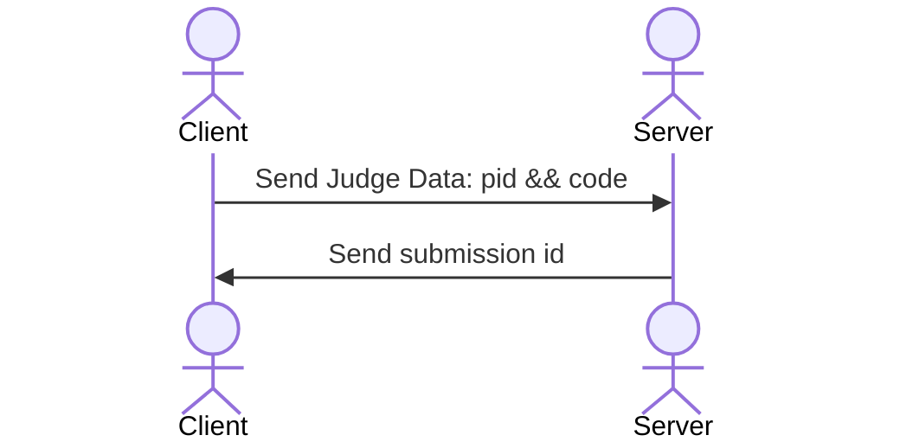
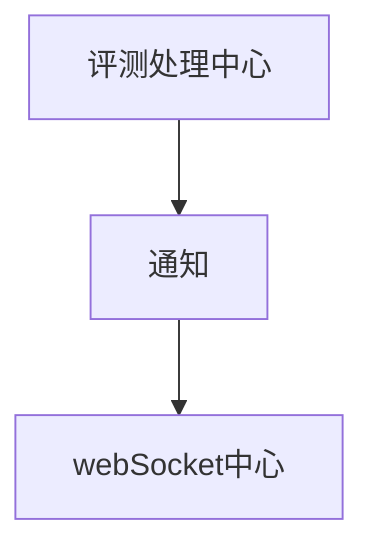

## 路由

| url             | 功能 |
|-----------------|------|
| `/prob/get?id=pid`    | 得到题目信息 |
| `/prob/submit`   | 提交题目评测 |
| `/prob/list?page=1&limit=100` | 得到题目列表 |

提交评测的过程

第一阶段提交

第二阶段: 根据sumbmission id,client与server 进入 websocket阶段

