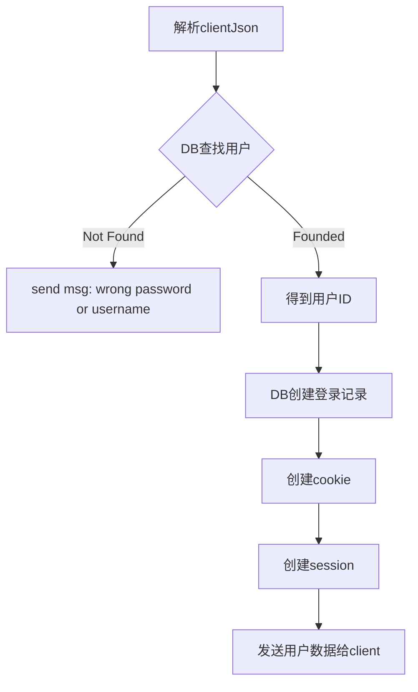
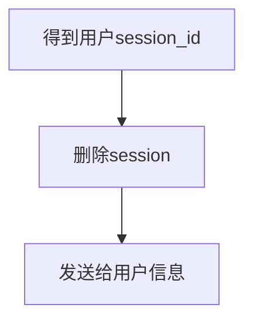

## 用户相关 user

| url             | 功能 |
|-----------------|------|
| `/usr/login`    | 登录 |
| `/usr/logout`   | 登出 |
| `/usr/register` | 注册 |

登录过程

```mermaid
graph TD
  a[解析clientJson]-->b{DB查找用户}
  b-- Not Found -->c[send msg: wrong password or username]
  b-- Founded --> d[得到用户ID];
  d-->e1[DB创建登录记录]
  e1-->e2[创建cookie]
  e2-->e3[创建session]
  e3-->e4[发送用户数据给client]
```

登出过程

```mermaid
graph TD
  a[得到用户session_id]-->b[删除session]-->c[发送给用户信息];
```
