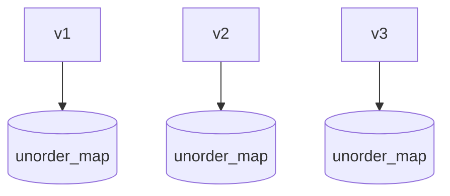

fastCache是一个使用c++17 实现的简易cache工具，目的是使代码不依赖Redis,Redis对一个小型的网站
太重了。

参考： https://github.com/active911/fastcache 的Cache容器,

## 实现原理：

在每一个节点上,持载一个`unorder_map`做为存储库,根据`hash(key)`来找
到每一个节点



使用了下面的c++库
```
std::hash
std::unorder_map  
std::optional
std::mutex  线程锁
std::chrono  时间库
```

- 一个单独的检测线程
- 单例模式 todo

## 如何使用

参见 [fastCache.cpp](../../example/tools/fastCache.cpp)
