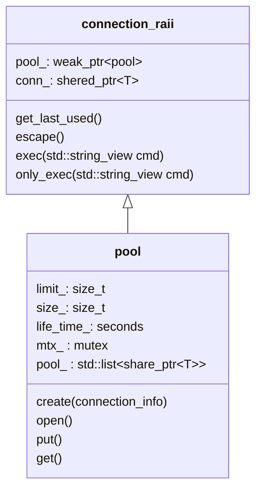

## Intro

rewirte [CppDB: CppDB - SQL Connectivity Library](http://cppcms.com/sql/cppdb/index.html) use cpp++20( use Literals class as Template Parameters)


```plaintext
include
├── backend
│   ├── mysql_backend.hpp mysql封装为connection
│   └── result_backend.hpp 对MYSQL_RES 进行封装
├── cexpr
│   └── string.hpp 编译期字符串
├── connection_info.hpp 连接信息的封装
├── cppdb.hpp
├── errors.hpp 错误信息
├── pool.hpp 连接池
├── pool_manager.hpp 连接池管理
├── sql
│   ├── column.hpp 封装的一列
│   ├── query.hpp 封装的查询
│   ├── row.hpp 封装结果的一行信息
│   └── schema.hpp 封装多行信息,表
└── utils.hpp 工具函数

4 directories, 13 files
```


## 代码架构

```
query<static_str,Result<>>
       │
       │                         ┌───────────┐
       │                         │           │
       │                         │           │
       │       exec              │   pool    │
       └────────────────────────►│           │
                                 │           │
                                 └──┬────▲───┘
                                    │    │
                                    │    │
                                    │    │
                            shared_ptr   │
                                    │    │
                                    │  weak_ptr
                                    │    │                           ┌──────────────────────┐
                                    │    │                           │                      │
                                    ▼    │                           │ backend::connection  │
                                 connection_raii ───────────────────►│                      │
                                                    encapsulate      │                      │
                                                                     │ backend::result      │
                                                                     │                      │
                                                                     └──────────────────────┘
```
backend是后台实现所有的真正的操作
pool是连接池,
query,exec时从内存池,取出一条连接,然后进行操作.当然,也可以给exec传递一条连接来执行.


## 设计思路


```
column->row(递归类)->schema(结果集)

query<command_str,schema>
```

### 连接池

从连接池pool取出一个连接,这个连接是一个RAII类型的对象,当这个连接使用完之后,会自己动返回到Pool里
.



API解释:

1. `std::share_ptr<pool> p = pool::create(connection_info &)` 创建一个连接池p
2. `p->open()` 从连接池里得到一条连接


### 前端设计

在`include/sql`是前端设计,使用了`c++20,use Literals class as Template Parameters`的技术.

目的:

1. `schema.hpp`,对查询结果的封装
2. `query.hpp`
  - 得到查询语句字符串.
  - 通过`schema`类型拿到结果

```mermaid
classDiagram
    class column
    class row
    class schema
    column <|-- row
    row <|-- schema

    class column {
        static constexpr cexpr::string name
        Type type
    }

    row {
        
    }
```


row 是由column拼接成的,它是一个类似`std::tuple`的结构

如果我们想们有下面的类型

```
using col1 = column<"col1",int>;
using col2 = column<"col2",int>;
using col3 = column<"col3",int>;

row_type<col1,col2,col3>
```

那么`row_type<col1,col2,col3>`到底是什么类型呢

```
row<col1,Next2_>

Next2_ = row<col2,Next3_>
Next3_ = row<col3,Next4_>
Next4_ = void_row
```

也就是这样的类型

```
row<col1, row<col2, row<col3, void_row> > >
```
这样我们就创建一个递归的类型

### query的设计

1.构造字符串


2. 得到运行的结果

```
int a =  q << exec();
如果结果只是单个值

row<col1,col2> = q << exec()
如果结果是一行数据


Result<row> 当然结果也可能是一个表


```

