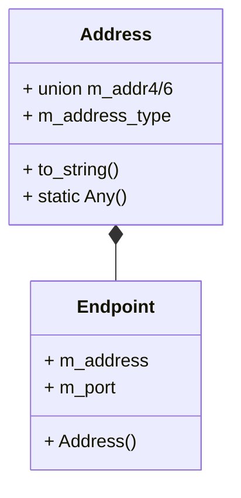
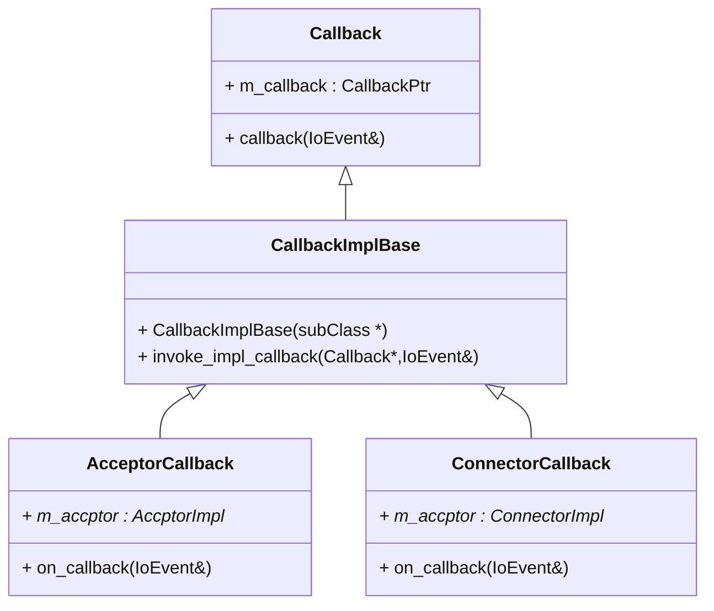
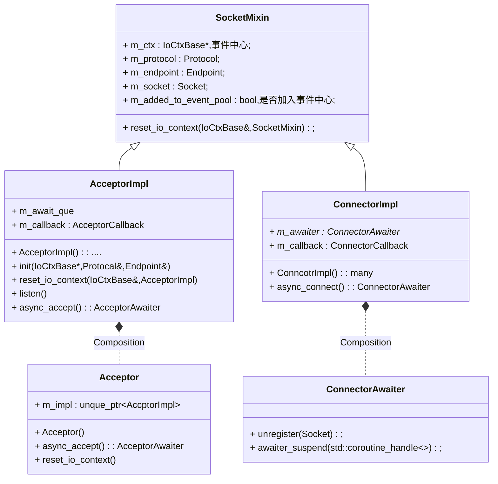
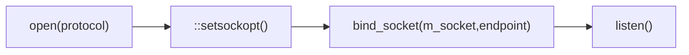
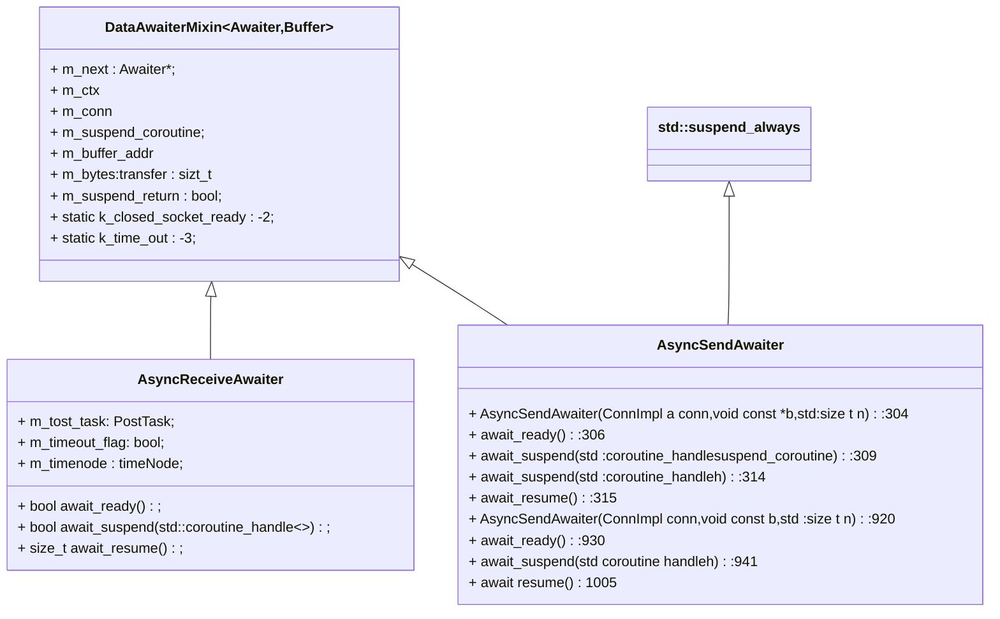
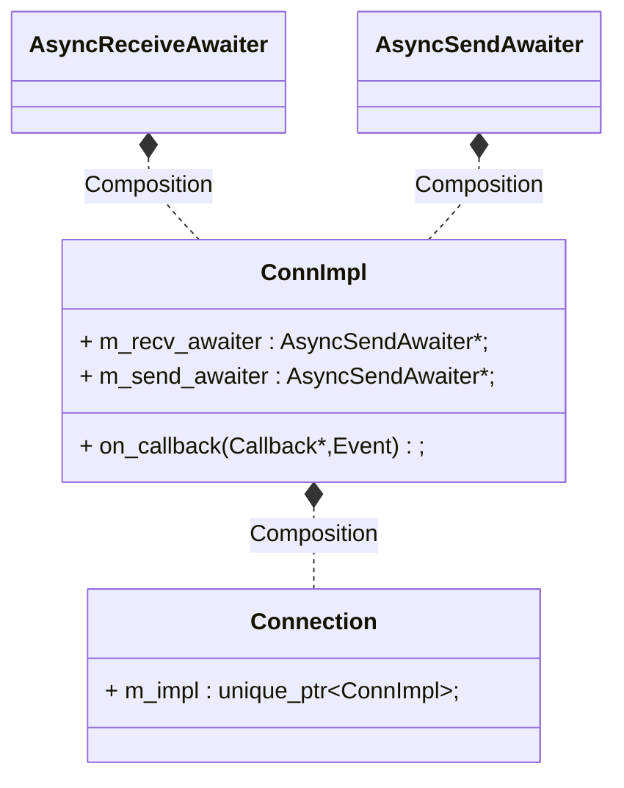

# awaiter的解析

`awaiter.h`共有2000多行,是所有代码里最长的.

先定义了一些常用的函数

```plaintext
void setnonblocking(NativeSocket fd):105
address address v4 from_string(char const str):120
address address_v6_from string(char const str):131
socket open_socket(Protocol const a protocol,bool blocking=false):143
void bind socket(NativeSocket socket,Endpoint const endpoint):178
ConnectorImpl async_connect(IoContext ctx,Protocol const a protocol,Endpoint const endpo
TimerAwaiter async_sleep(IoContext s ctx,std:chrono:nanoseconds elapse):2170
```

## 类图谱

地址相关
```plaintext
struct Protocol //v4 v6 协议
enum class AddressType 协议类型
struct Address 地址抽象
struct Endpoint 地址+端口
```

辅助函数

```plaintext
void setnonblocking(fd) 设定socket无阻塞
TODO 什么是无阻塞

address_v4_from_string 转换,工厂函数
address_v6_from_string 转换,工厂函数

bind_socket(socket,Endpoint) socket与端口,地址的绑定,
  用于Acceptor的创建

```

```plaintext
DataAwaiterMixin 一个Awaiter需要的数据 
  Awaiter* m_next    下一个awaiter指针
  IoCtxBase * m_ctx  ioctx 指针
  m_conn connect指针
  m_suspend_coroutine 协程句柄
  m_buffer_addr  buff地址,buff的作用????
  m_buffer_size  buff大小
  m_bytes_transfer 字节接收/发送的数量
  m_suspend_return return时是否挂起?
  static constexpr k_closed_socket_ready 已经关闭socket?
```

异步的接收
```plaintext
class TINYASYNC_NODISCARD AsyncReceiveAwaiter :
    public DataAwaiterMixin<AsyncReceiveAwaiter, void*>
```
作用

如果`connect`已经准备好接收了,那就接收,不会挂起协程,否则挂起协程,等待接收.接收的数据存在Awaiter的buff里

需要注意的是`connect->next`的含义


异步的发送`AsyncSendAwaiter`

同时它设计了以下的类, 类图如下:

## Address

Address是对网址地址的抽象,它包含,ip地址,端口号,协议.三个部分.




## AcceptorCallback,ConnectorCallback


其中,`Callback,CallbackImplBase`都是定义在`io_context.h`头文件里.在[对应的文档](./io_context.md)里讲解过对应的原理,这里不再赘述.

`AccptorCallback,ConnectorCallback`两都是回调用函数,内部定义的`on_callback`,在需要的时候执行.

`AccptorCallback`内部存了一个`AcceptorImpl`的类指针.

## Acceptor,Conncotr



`Accptor`是一个接收器,在它的内部完成了


我们知道在创建tcp服务器代码时,会经历下面的代码过程


在`AccptorImpl`的构造函数中调用了`init()`函数



其时分别完成下面的功能:

- 创建socket
- 设置socket address reuse
- 绑定socket到对应的端口
- 使用socket进入监听态

`SocketMixin`是`AccptorImpl`与`ConncotrImpl`所共有的数据,表示与`socket`相关的数据

- `m_ctx : IoCtxBase*`,事件中心;
- `m_added_to_event_pool : bool`,是否加入事件中心;


`Acceptor`的本质是在内部拥有一个`std::unique_ptr<AccptorImpl> m_impl`的成员变量,以此来
完成相对应的功能.它的执行过程如下

1. 创建`Acceptor`对象,过成上面的init()过程
2. 可以通过`reset_io_context`函数重新把对应的acctpor的socket注册到对应事件中心上
3. 调用`async_accept`函数,得到`AcceptorAwaiter`挂起对应的协程.
4. 调用`AcceptorAwaiter.await_suspend`
    ```plaintext
    AcceptorAwaiter:
       m_node:  ListNode
       m_acceptor: 指向对应Acceptor的指针
       m_conn_socket: 创建的Connection socket
       m_suspend_coroutine: 协程句柄
       from_node(ListNode * node): 通过m_node 得到AcceptorAwaiter的指针
       await_ready(): return false ,挂起协程
       AcceptorAwaiter(AcceptorImpl & acceptor): 得到Acceptor对象的指针
       await_suspend(std::coroutine_handle<Promise> suspend_coroutine):
       await_suspend(std::coroutine_handle<TaskPromiseBase> h):
          1. 向Acceptor内m_awaiter_que push self
          2. 设定IoEvent.data.ptr = acceptor.m_callback
          3. 设定IoEvent EPOLL_IN
          4. EPOLL_CTL_ADD Acceptor.m_socket in epollfd
       await_resume():
      AcceptorAwaiter(AcceptorImpl & acceptor):
      await_suspend(std::coroutine_handle<TaskPromiseBase> h):
      await_resume():
    ```
5. 当accept事件发生的时候,调用`Acceptor.m_callback`
  - 从accept的`m_await_que`取出对应的AcceptorAwaiter对象的指针
  - `::aceptor`得到`client_socket`,并设置`AcceptorAwaiter.m_conn_socket`
6. 调用`AcceptorAwaiter`里的`await_resume`,
  - 设定`setnonblocking`
  - 创建并返回一个Connection对象


## Awaiter



`Awaiter`就是等待器,作用是:

1. 让所在的coroutine(协程)suspend(挂起)
2. 当resume(恢复)对应的协程的时候,返回相应的值


`DataAwaiterMixin`,awaiter所 共有的数据.

faq:什么时候会resume对应的coroutine(协程)? 

answer: `AsyncReceiveAwaiter,AsyncSendAwaiter`这两个等待器会suspend对应的coroutine.同时`AsyncReceiveAwaiter`,`AsyncSendAwaiter`
这两个等待器类是`Connection`的相应函数(`async_read`,`async_send`)的返回值.调用这些函数,
`await conn.async_send()`,会suspend对应的coroutine.

当对应的事件发生时,`EPOLL_IN,EPOLL_OUT`,会调用`conn.on_callback`,而`on_callback`内部
会根据事件的不同调用不同awaiter的`await_resume`,进而得到相应的返回值.

当然这些`Awaiter`的设计还有很多细节,比如:1. `m_next`的作用. 2. `m_ready_to_recv`的作用,什么情况下会发生在`awaiter_suspend`时`read_to_recv`?

TODO:这些等我有时间后面写.

## Connection

`Connection`是对连接的抽象.包含了对一个连接的相关操作:异步读,异步写.




- address
- Endpoint
- AsyncSendAwaiter
- AsyncReceiveAwaiter
- Connection
- Acceptor
- AcceptorAwaiter
- Connector
- ConnectorAwaiter


各种awaiter的作用就是配合协程,使协程挂起,当然挂起时,把回调(`resume`)
注册到`IoCtx`事件中心上,当相应的事件发生的时候,就会唤醒对应的协程.

核心的`Awaiter`如下

- Acceptor,等待连接,产生`Connect`
- Connect,
  - `AsyncRecv`,发送
  - `AsyncSend`,接收


## Connection

`struct ConnImpl`底层实现

- `register()` 把`connect`注册到`IoCtx上`

这里使用了`EPOLLONESHOT`,为什么要使用这个,看下面的解释

[epoll的LT和ET使用EPOLLONESHOT - 走看看](http://t.zoukankan.com/kex1n-p-7451069.html)

一个conn可能有多个`Awaiter`

```plaintext
- m_ctx --> 
- m_conn_handle --> 
- m_callback --> 
- m_recv_awaiter --> 
- m_send_awaiter --> 
- m_post_task --> 
- m_ref_cnt --> 引用的数量,当为0时,会删除conn的占用的内存
- m_added_to_event_pool --> 
- m_recv_shutdown --> 
- m_send_shutdown --> 
- m_ready_to_send --> 
- m_ready_to_recv --> 
- m_tcp_nodelay --> 
+ native_handle() --> 
+ register_() --> 
+ reset() --> 
+ on_callback(Callback * callback,IoEvent & evt) --> 
+ ConnImpl(IoCtxBase & ctx,NativeSocket conn_sock,bool added_event_poll) --> 
+ ConnImpl(ConnImpl const &) --> 
+ operator =(ConnImpl const &) --> 
+ set_tcp_no_delay(bool b=true) --> 
+ async_read(void * buffer,std::size_t bytes) --> 
+ async_send(void const * buffer,std::size_t bytes) --> 
+ is_any_shutdown() const --> 
+ is_recv_shutdown() const --> 
+ is_send_shutdown() const --> 
+ is_recv_send_shutdown() const --> 
+ safe_shutdown_recv() --> 
+ safe_shutdown_send() --> 
+ safe_shutdown_recv_send() --> 
+ shutdown_recv() -->  调用::shutdown(conn_handle,SHUT_RD)
+ shutdown_send() -->  调用::shutdown(conn_handle,SHUT_WR)
+ shutdown_recv_send() --> 
+ safe_close() --> 
+ close() --> 
+ ~ConnImpl() --> 
 on_callback(Callback * callback,IoEvent & evt) --> 
+ wakeup_awaiter_on_close(PostTask * posttask) --> 
   this_type --> 
```

`Connection`的定义,基本上是对`ConnImpl`的wrapper


```plaintext
- m_impl --> ConnImpl's unique_ptr
+ Connection() --> 
+ Connection(Connection &&) --> 
+ operator =(Connection &&) --> 
+ Connection(IoCtxBase & ctx,NativeSocket conn_sock,bool added_event_poll) --> 
+ ~Connection() --> 
+ set_tcp_no_delay(bool b=true) --> 
+ is_closed() --> 
+ is_recv_shutdown() --> 
+ is_send_shutdown() --> 
+ is_recv_send_shutdown() --> 
+ shutdown_recv() --> 
+ shutdown_send() --> 
+ shutdown_recv_send() --> 
+ safe_shutdown_recv() --> 
+ safe_shutdown_send() --> 
+ safe_shutdown_recv_send() --> 
+ safe_close() --> 
+ close() --> 
+ native_handle() --> 
+ async_read(void * buffer,std::size_t bytes) --> 
+ async_read(Buffer const & buffer) --> 
+ async_send(void const * buffer,std::size_t bytes) --> 
+ async_send(ConstBuffer const & buffer) --> 
```


执行逻辑与过程

1. 构造函数,`ConnImpl`
  1. 设定成员变量`Callback m_callback.callback = this.on_callback`
  2. `event.data.ptr = &this->m_callback`
  3. 把`m_conn_handle`加入到事件中心进行监听
2. 调用`conn->async_read()`,对应的事件发生时
  1. `conn->on_callback`处理`::recv`
  2. 调用对应的awaiter的resume()
3. 调用`conn->async_send()`,对应的事件发生时
  1. `conn->on_callback`处理`::send`
  2. 调用对应的awaiter的resume()
