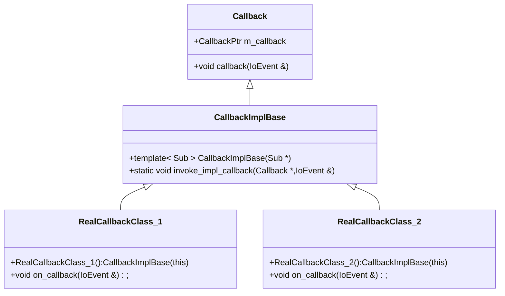

# Callback

把Callback理解成一个动态的函数指针,可以像虚函数一样动态执行不同函数.但它不是一个
虚类.

它的构造如下



`CallbackPtr`的类型是`using CallbackPtr = void(*)(Callback *,IoEvent &)`.
我们希望如下的运行过程

```cpp
RealCallbackClass_1 c1; //定义类c1
RealCallbackClass_2 c2;

Callback * p1 = &c1; //转成基类指针
Callback * p2 = &c2;

p1->callback(p1,evt); //最终调用c1.on_callback(evt)
p2->callback(p2,evt); //最终调用c2.on_callback(evt)
```

如何调用(使用)呢?

`CallbackImplBase`有两个模板函数:

- 一个模板构造函数,作用:给子类的构造函数调用,子类调用的时传入子类的this指针,进面知道了子类的类型
- 一个模板成员函数,作用:记录子类的类型,把`Callback`指针转成子类指针,调用的子类的`on_callback`函数

当子类(c1)的构造函数调用父类(CallbackImplBase)的构造函数的时候,CallbackImplBase就记录
了子类的类型,同时产生一个相对子类类型的`invoke_impl_callback`成员函数.

所以`CallbackImplBase`在这里处于两个类(Callback,c1)中间的位置,相关于一个容器.妙!


类的布局图

```
+--------------------+            +--------------------+    
|m_callback          |            |m_callback          |    
|                    | A          |                    | A  
+--------------------+            +--------------------+    
|b_do_call<type C1>()|            |b_do_call<type C1>()|    
|b_do_call<type C3>()|            |b_do_call<type C3>()|    
|b_do_call<type C2>()| B          |b_do_call<type C2>()| B  
|   ......           |            |   ......           |    
+--------------------+            +--------------------+    
|                    |            |                    |    
|on_callback()       | C1         |on_callback()       | C2 
|                    |            |                    |    
+--------------------+            +--------------------+    

b_do_call 就是 invoke_impl_callback
```

简单的实现的代码,见`./code/callback.cpp`


