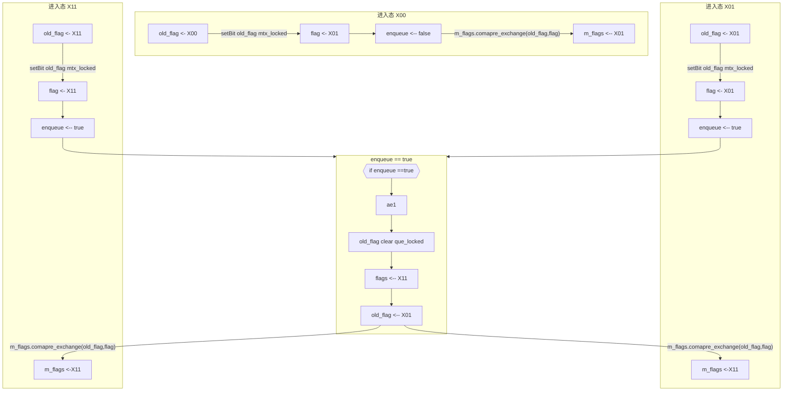
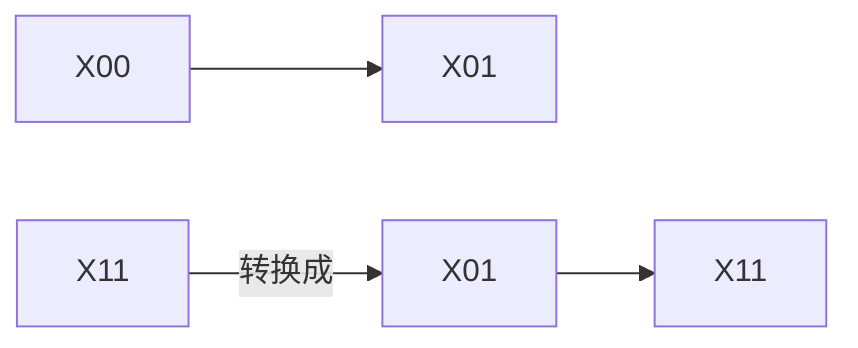

# mutex.h

主要功能,实现了一个无锁队列,保证那些需要按顺序执行的任务,按顺序执行

- Mutex
- AdoptUniqueLock
- WaitAwaiter
- Event,事件
- Condv


```mermaid
class
LockCore
Mutex
  LockCore m_lockcore
MutexLockAwaiter
AdoptUniqueLock
WaitAwaiter
WaitCallback

PostTask
PostTaskEvent
Event
EventAwaiter
Condv
CondvAwaiter

```

`LockCore`是一切的基础

`Mutex`建立在`LockCore`上

`MutexLockAwaiter`与`Mutex`有什么关系?
`AdoptUniqueLock`建立在`Mutex`上,它的作用是什么?
`WaitAwaiter`建立在`Mutex`的基础上,它的作用是什么?

`Event`建立在`IoContext ctx`上,似乎是建立我们自己的事件,可以通知Io中心

## LockCore

LockCore的操作过程,分为两个阶段.

第一阶段: **Lock Something**

在这个阶段结束后,`enqueue`,

- 为`false`表示,进入态为`X00`,也表示队列是第一次添加内容,
- 为`true`表示,进入态为`X01 || X11`,进入时,队列不是第一次添加内容,可能为`que_locked`(`X11`)




状态变化



`X11`表示`queue_locked`

第二阶段,根据`enqueue`的值进入相应的处理

- 为`false`,do nothing,最后返回`true`
- 为`true`,队列添加节点,`m_flags`变成`101`,表示队列不为空,最后返回false


**conclusion**

第一次`try_lock`,会返回true,得到状态`001`,不会真正的把元素加入队列内
所以,非第一次`try_lock`会把元素加入到队列内,返回`false`,得到状态`101`

## unlock 过程

`unlock(bool unlock_mtx_only_if_que_empty)` 表示从队列中取出元素,它的参数`unlock_mtx_only_if_que_empty`表示,取出元素时是否只在**取出元素后,队列为空时,才设置mtx位为0**

- 返回`nullptr`表示队列中没有元素

整个`unlock`的过程分为三个阶段

1. 阶段1,加锁段,如果此时,发现队列为空,那么`return nullptr`
2. 阶段2,取出队列中的元素
3. 阶段3,解锁段 


它的核心操作如下


`LockCore`是一个无锁队列,完成多线程下的队列操作

它的核心操作为:

1. `try_lock(ListNode*)`,将`ListNode`加入队列
2. `unlock()->ListNode *`,从队列中取出一个`ListNode`

但它特殊在,如果是第一次添加项目,也就是在队列是空的条件下添加项目


`LockCore`是一个三元状态锁,三种状态为:`[mtx][que][que_notempty]`

- `mtx`表示本身是否是**加锁态**
- `que`表示队列是否是**加锁态**
- `que_notempty`表示队列是否是**加锁态**

一般的无锁队列只有一个**原子锁**,或者说**原子锁**只有一个状态,表示队列是否加锁.那为什么`LockCore`有三个状态呢?

**如何保证状态一样的时候,不会出错?**

### `try_lock`操作

函数原型:`bool try_lock(ListNode * p)`

前置知识`m_flags.comapre_exchange_strong(A,B)`,如果`m_flags == A`,那么
`m_flags`就会原子性的替换成B,这整个操作是原子的,无论成功与否,A都会变面`m_flags`
的值

```
0,0,0   初始状态
  |
  v
0,0,1   mtx锁上,que无锁
  |
  v
0,1,1   mtx,que都锁上
```

```plaintext
如果 mtx locked
  返回 true ,表明已经锁上
否则
  加入 把p加入队列
  return false
```

### unlock

解锁与取数据

函数原型

```
ListNode *unlock(bool unlock_mtx_only_if_que_empty)
```

```
如果 队列 非空
  如果 unlock_mtx_only_if_que_empty == false
    也就是不需要空的时候才删除mtx lock
    unlock mtx lock
  取出队列头 p
  返回 p
否则
  解锁 mtx lock  
  返回 nullptr
```

## 解析 Mutex与 MutexLockAwaiter

- `MutexLockAwaiter`
- `Mutex`

建立在`LockCore`上的一个锁,主要功能,

如果你在多个协程上`co_await Mutex.lock()`,那么这些协程会按顺序的`resume`

像队列一样,按顺序执行

那它是如果实现的呢?

`MutexLockAwaiter`挂起协程后

```plaintext
(1) if we don't acquire the mutex
this coroutine will be enqueued
如果我们没有获得mtx锁,那么这个协程句柄就会加入队列中

if the owner of the lock unlock the mutex
then this crooutine would be poped out
then this coroutine would be resumed

如果锁的拥有都unlock了锁,那么协程就会resume

if owner of the mutex unlock the mutex before this function return
如果 mutex的拥有者在这个函数返回前 unlock了
the coroutine will be resumed before this function return
那么这个协程会在这个函数返回前,resume

thus we should invoke the lock in await_suspend instead of await_ready
In await_ready the state of this cocoutine is not saved
因此,我们应该在 await_suspend 里执行lock,而不是在`await_ready`里执行
,因为 await_ready 的时候,协程的状态还没有保存

(2) if we acquire the mutex
then this coroutuine continue to run
如果我们获得锁,那协程继续运行
```

一个awaiter的`await_suspend`
- 如果返回true,挂起协程
- 返回false,恢复协程

返回

`try_lock` 加入了p,也就是没有获得锁,那么`await_suspend return !false`,
也就是挂起协程,如果`try_lock`返回`true`,也就是获得了锁,那就是`await_suspend return !true`
恢复协程,继续执行

## AdoptUniqueLock

TODO

## Awaiter,WaitCallback

- `wait(Mutex &mtx, Awaiter & awaiter)`函数

## Event,EventAwaiter

对于事件,我们应该关心下面的东西

- 事件如何定义:`Event myevent(ctx)`
- 事件如何监听:`co_await myevent`
- 事件如何发生:`myevent.notify_one()`
- 事件如何回调,没有,需要做的是等待事件的发生,才能继续执行


- `PostTaskEvent`
- `EventAwaiter`


```mermaid
class
  class Event {
      m_awaiter_que;
      m_ctx : IoContext *;

      static on_notify(PostTask *) -> void;
      void notiy_one();
      void notiy_all();
  }
```

Event含有一个可以存所有`EventAwaiter`对应指针的队列.

也就是说每一个`EventAwaiter`产生的时候,都会对应的Event对象`m_awaiter_que`队列里加入代表自己的指针.

ctx里的PostTask队列执行的时候,应该调用`Event::void no_noity`,这样Event就可以有一回调函数,被ctx执行了

`notify_one`,队列中取出一个`awaiter`指针,`notify_all`队列取出所有的`awaiter`指针
设定PostTask,加入ctx的posttask队列,等待被执行.


核心功能:

0. `Event`队列中存有`EventAwaiter`队列,如果`co_await EventAwaiter`,会把`EventAwaiter`加入到队列中
1. `notify_one`,从队列中取出一个`awaiter`,放入到ctx的`post_task`队列中,这样就会执行一件事件
2. `notify_all`


作用?

## Condv

- `Condv`
- `CondvAwaiter`
