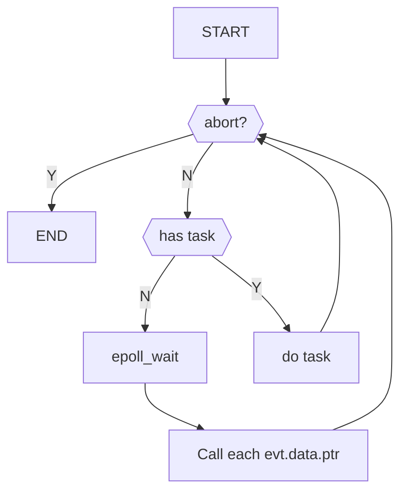

# 说明

[lhprojects/tinyasync](https://github.com/lhprojects/tinyasync) 是一基于c++20 coroutine(协程)的网络IO库.

rojcpp使用了这个库,并进行了少量的修改.基于我写rojcpp的原则: 尽量自己完成所有的功或读懂所用的库的源码.
所以下面我尽量详细的解释tinyasync的源码.

fork到我的仓库: https://github.com/rainboyOJ/tinyasync

当然,你需要先学习使用c++20的coroutine,篇幅的原因,我不在这里讲解coroutine的使用.请参考我的博客(blog.roj.ac.cn)上相关的内容

## 文件结构

```plaintext
include
└── tinyasync
    ├── awaiters.h  各种的等待器,实现的协程的暂停
    ├── basics.h    所需的头文件,基础类,工具类的定义
    ├── buffer.h    buffer数组
    ├── dns_resolver.h  hostName 转 ip
    ├── io_context.h    核心,IO事件中心
    ├── memory_pool.h   内存池,内存分配
    ├── mutex.h         锁,队列锁,无锁队列
    ├── task.h          协程的Return Object 实现
    └── tinyasync.h     包含其它头文件
```

## 框架设计

整个代码由下面几个功能组合来完成整体的功能

先设计一个核心模块:`io_context`,把它叫作事件中心或者叫IO中心,基本上把需要的任务或事件都注册到它身上.

它拥有一个大循环,我们称为`run`





## 功能模块

- [模拟虚类,callback](./functional/callback.md)
- [日志调试](./functional/log.md),好的日志调试事半功倍,有些时候,相比使用gdb,节省很多的时间.
- [`IoContext`事件中心](./io_context.md)
- [awaiter](./awaiter.md),协程等待器,用于暂停协程

- [`tash.h`],功能库,设定了协程的相关,来控制协程的运行行为,包括,
  - 1.内存申请
  - 2.生命周期
  - 3.协程句柄,基类
  - 4.协程生命结束的行为
  - 非常有用的[`co_spawn`功能](./co_spawn.md)


## 概念/功能


`buffer`,定义了两个类型的buffer来,提供内存buffer

- 1. `Buffer`,本质是真正buffer的wrapper
- 1. `ConstBuffer`,只读的buffer

各种`Aawaiter`:

- `AsyncReceiveAwaiter` 异步接收数据
- `AsyncSendAwaiter` 异步发送数据
- `Connector` 连接服务端
- `AcceptAwaiter` 接收连接
- `ConnectorAwaiter` 发送连接
- `TimerAwaiter` 异步等待

它们的作用,向ctx中心注册事件,等对应的事件发生时,使协程resume


`mutex.h`,实现了如下

无锁队列,如果你需要某些任务,不能现时的执行,那么你需要它
同时还实现了一些学用的锁
具体看[`mutex.h`解析](./mutext.md)

`dns_resolve` 异步的dns解析

`memory_pool`基于`pmr`的内存池

## 解析

- [`io_context`解析](./io_context.md)
- [`co_spawn`抛出不管协程](./co_spawn.md)


## PostTask

加入任务的队列的有哪些

- post_task 函数

`io_context`里有
`dns_resolve`里
`mutex.h`里有

需要压入任务的
`awaiter.h`
`mutex.h`
`dns_resolve.h`
