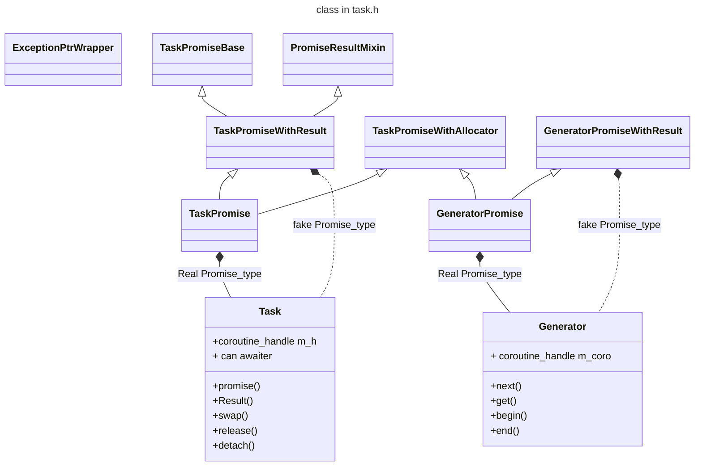

# task.h

协程的实现相关[参考cppreference上的相关内容](https://en.cppreference.com/w/cpp/language/coroutines)

主要功能:实现了`coroutine`协程的`promise object` 实现,来控制协程的运行行为,使对应的协程具有以下的性质

- 1.内存申请
- 2.生命周期
- 3.协程句柄,基类
- 4.协程生命结束的行为
- 非常有用的[`co_spawn`功能](./co_spawn.md)
- 内存申请

类图

## task的能力, `co_await`

因为Task重载了`co_await`,所以它可以像
一个`Awaiter`一样.

- `await_ready() -> false`直接挂起对应的协程
- `await_suspend`,设置了`m_h.promise().m_continuation`,返回了一个`m_h`
那么`m_h`对应的主协程,会resume

