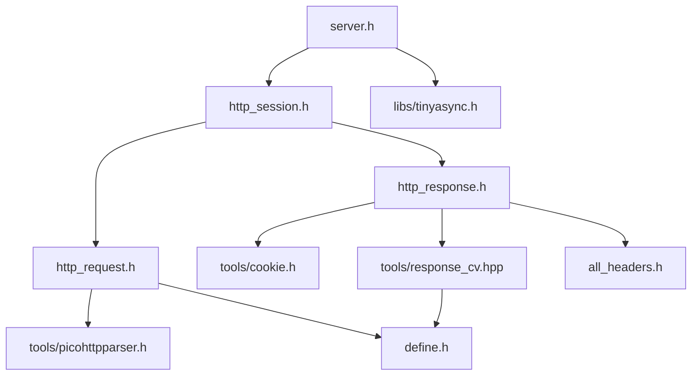

# RojCpp 

基于 c++20 的oj服务器后端,整个OJ由三个部分组成,这里是`后端cpp`部分


```plaintext

+---------+         +---------+       +---------+
|         |         |         |       |         |
| 前端vue | <------>| 后端cpp | <---->| 评测cpp |
|         |         |         |       |         |
+---------+         +---------+-      +---------+

```


## 目录结构

```plaintext
.
├── include 头文件
│   ├── all_headers.h
│   ├── debug.h
│   ├── define.h
│   ├── http_request.h
│   ├── http_response.h
│   ├── http_session.h
│   ├── multipart_parser.hpp
│   ├── server.h
│   ├── site_conf.hpp
│   └── tools
│       ├── buffers.h
│       ├── cookie.h
│       ├── fastCache.hpp
│       ├── gzip.hpp
│       ├── mime_types.hpp
│       ├── picohttpparser.h
│       ├── response_cv.hpp
│       ├── url_encode_decode.hpp
│       └── utils.hpp
├── src  头文件的实现
└── libs
    └── tinyasync IO框架,基于c++20 coroutine
```


## 头文件的包含关系



## 文档

- [工具库utils.hpp](./docs/tools/utils.md)
